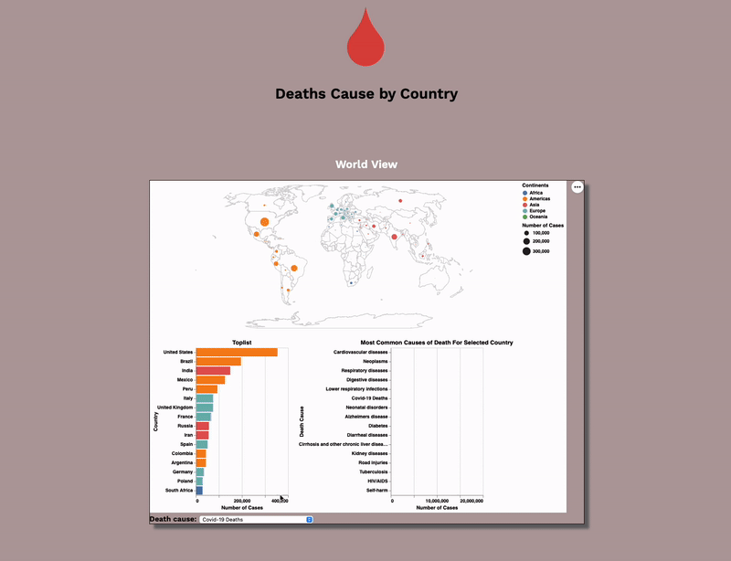

# Death-Cause-Data-Viz-By-Country

This repository includes a Jupyter Notebook (.ipynb) file showcasing the process of importing datasets and creating visualizations for death causes by country on a geographic plot. The notebook leverages Python and popular libraries such as Pandas, Altair, Seaborn, and NumPy for effective data manipulation and visualization.

Furthermore, the repository incorporates .html files containing the finalized plots, as can be seen in the .gif in this README. Open these files for convenient access to the visualizations or alternatively, use the notebook for a more detailed exploration of the data.

This project was done in collaboration with Anders Lundkvist.

# Introduction 

In low- and middle-income countries, mortality rates attributed to infectious diseases, malnutrition, nutritional deficiencies, neonatal and maternal deaths are prevalent, often dominating the health landscape. For instance, in Kenya, diarrheal infections remain the primary cause of death, while HIV/AIDS stands as the leading cause in South Africa and Botswana. In contrast, high-income countries experience a significantly lower proportion of deaths from these causes.

The visualization can be used to address the following questions:

1. What are the most common death cause reasons by country?
2. Are ther any correlation between geographihal place and type of deaths?

# Datasets

The main dataset contains the death causes by all genders and by all age groups by country. Additionally, three smaller datasets containing information on country populations, coordinates, and continents were utilized.

The main dataset was collected from: https://www.who.int/, the World Health Organization
